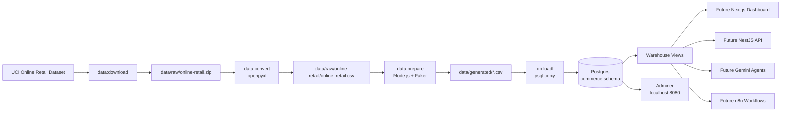
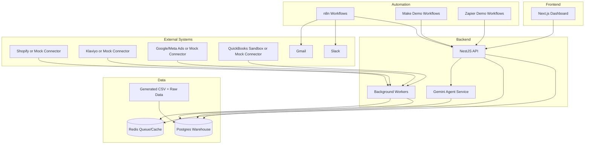
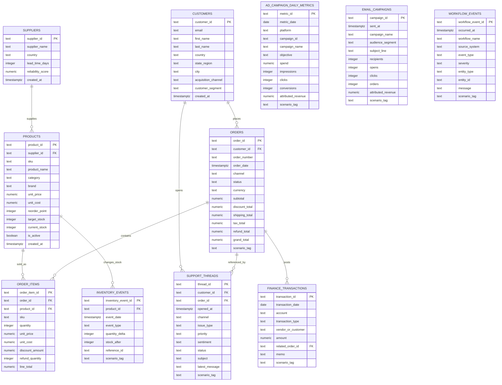

# CommerceOps AI OS Architecture

## Project 1 Context

Project 1 is the data foundation for CommerceOps AI OS. It turns a public retail transaction dataset into a Postgres warehouse that can support dashboards, agents, reporting jobs, and workflow automations.

The current system is intentionally free-tier friendly:

- Local and cloud demo infrastructure can run with Docker Compose.
- Postgres stores the operational warehouse.
- Adminer gives a lightweight database browser.
- Source data comes from the UCI Online Retail dataset.
- Faker enriches missing operational systems such as suppliers, support, finance, ads, and workflow events.

## Runtime Architecture

## Planned Application Architecture

## ERD

## Data Flow

1. `npm run data:download` downloads the UCI Online Retail archive.
2. `npm run data:convert` converts the workbook to CSV through a local Python virtual environment.
3. `npm run data:prepare` transforms public transactions into warehouse-ready CSV files.
4. `npm run db:up` starts Postgres and Adminer.
5. `npm run db:schema` creates tables, indexes, and views.
6. `npm run db:load` loads generated CSV files into Postgres.

## Business Questions This Warehouse Can Answer

- What happened to revenue, order count, refunds, and gross profit over time?
- Which products drive the most revenue and margin?
- Which products are at reorder risk or stockout risk?
- Which ad campaigns are wasting spend because ROAS is low?
- Which acquisition channels and customer segments produce the most customers?
- Which support issues are increasing, and are they tied to refund or quality problems?
- Which workflow alerts are most frequent or severe?
- Which finance accounts are driving income and expense movement?
- Which scenario tags explain notable events such as Black Friday, support escalations, or stock risk?

## Why This Matters For The Portfolio

This architecture shows that the project is more than a chatbot. It has a real operating data layer, a repeatable data pipeline, warehouse views, operational entities, and clear places for future dashboards, agents, and automations to connect.

